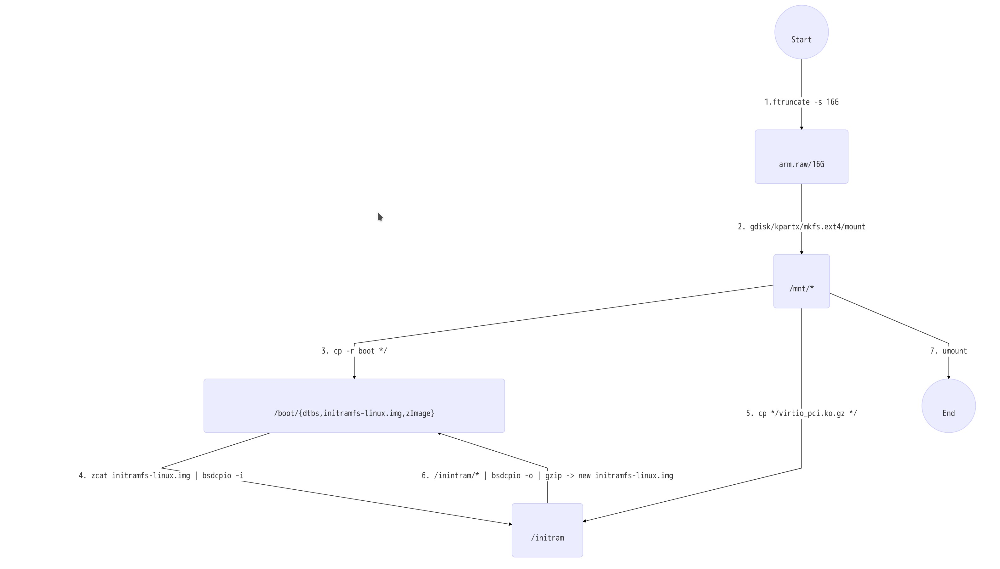
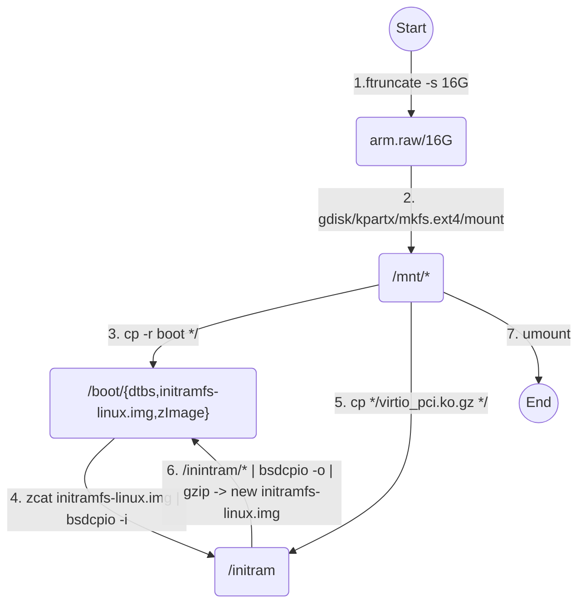

# Qemu dev env for arm and aarch64 setup


### 1.  Requirement

- A "native" virtual dev/debug environment for  Arm learning , instead of cross tool chain in PC host.   Since the focus is on Arm assembly, toolchain(c/c++/gdb),  a general Arm v7/v8 qemu machine will suffice .  The generic "virt" machine type will be used when creating Qemu virtual machine,  for both arm/aarch64,  instead of  a specific board. 

- A 32bit arm cpu could be used for arm 32 programming;  A 64 bit  cpu could be used for aarch64 arm programming;  For detailed list of cortex-A series CPU, please refer to [Arm contex-A](<https://en.wikipedia.org/wiki/ARM_Cortex-A>)

  

- Linux distro:  Archlinux will be used, for both arm/aarch64.   Similarly, a generic build of archlinux will be used instead of a build for specific board. 

  Archlinux arm distro Link

  [armv7](http://www.archlinuxarm.org/os/ArchLinuxARM-armv7-latest.tar.gz)

  [aarch64](http://www.archlinuxarm.org/os/ArchLinuxARM-aarch64-latest.tar.gz)


### 2.  Host environment

Archlinux for PC.   Here are the necessary packages:

```bash
pacman -S qemu qemu-arch-extra multipath-tools libarchive gdisk wget asciinema

```


### 3.  arm(32) qemu setup

I have recorded all command line operation via [Asciinema](<https://asciinema.org/>)  and uploaded the cast onto [armv7.cast](<https://asciinema.org/a/250291/>) .   Feel free to check out the [local cast files](armv7.cast)  or go directly to Asciinema. 

I use "mermaid" in this file.   Although github does not support in-place display for mermaid contents, many markdown editor support it , i.e. typora.   You can also install a [chrome extension](https://chrome.google.com/webstore/detail/mermaid-diagrams/phfcghedmopjadpojhmmaffjmfiakfil)  to view "mermaid" contents on github. 

- ##### disk image/kernel  preparation([disk.sh](disk.sh))

The stock rootfs image from archlinuxarm does not include "**virtio_pci**" driver either in kernel or in initramfs.  The qemu-system-arm "virt"  machine is equipped with PCI interface hard disk and a PCI Ethernet card.  We need to inject virtio_pci driver into the initramfs so Qemu can boot from the stock rootfs via pci hard disk interface. 

Be reminded that all files within an initramfs must be owned by root user, or Linux kernel will refuse to load this initramfs.  

- ftruncate : create big size empty file
- kpartx:  extract partition information from disk file and setup loop device
- bsdtar/bsdcpio/gzip:   extract/create initramfs file 
- gdisk:  disk partition
- mkinitcpio:  generate new initramfs 
- insmod:  manually load a kernel driver
- blkid:  record the partuuid of the rootfs partition, to be used in kernel cmdline to select rootfs device

Below is the flowchart for the disk image preparation.






- ##### Qemu network setup([netup.sh](netup.sh))

  We use a bridged network for Qemu.  A bridge device "**br0**" will be created. A tap device "**tap0**" will be created and join "**br0**"  bridge.   Qemu will use "**tap0**" to communicate with Internet. 

  Since in stock arm image, systemd-networkd is enabled, so it  will configure tap0 via dhcp. 

  Accordingly, we don't need to provide "ifup/ifdown" script for Qemu in start up script. 

  Refer to [netup.sh](netup.sh)  and [netdown.sh](netdown.sh)   for the command line to setup/tear down bridge network. 


- ##### Qemu startup script([arm.sh](arm.sh))

  It is time to startup our Qemu instance.  According to [qemu arm 32bit pci bug](https://bugs.launchpad.net/qemu/+bug/1790975) , I need to use **"-M virt,highmem"**  in Qemu startup  to workaround this bug. 
 
  After login, if we upgrade linux kernel, we need to copy new kernel/initramfs out of VM so Qemu can use new kernel/initramfs. 

  


- ##### User space tool chain setup([userspace.sh](userspace.sh))

​       We already copy userpsace.sh  into /mnt/root/ when execute disk.sh. After login, we can just run this script to initialize pacman and then install all the necessary packages like gcc gdb, etc. 


- ##### Simple test
```bash
[alarm@alarm ~]$ cat hello.c
#include <stdio.h>

int main(void) {
        printf("Hello Arm World!\n");
        return 0;
}

[alarm@alarm ~]$ gcc -g hello.c
[alarm@alarm ~]$ ./a.out
Hello Arm World!

[alarm@alarm ~]$ gdb ./a.out
(gdb) l
1       #include <stdio.h>
2
3       int main(void) {
4               printf("Hello Arm World!\n");
5               return 0;
6       }
7
(gdb) b main
Breakpoint 1 at 0x580: file hello.c, line 4.
(gdb) r
Starting program: /home/alarm/a.out 

Breakpoint 1, main () at hello.c:4
4               printf("Hello Arm World!\n");
(gdb) n
Hello Arm World!
5               return 0;
(gdb) c
Continuing.
[Inferior 1 (process 1007) exited normally]
```


Everything works O.K. 
